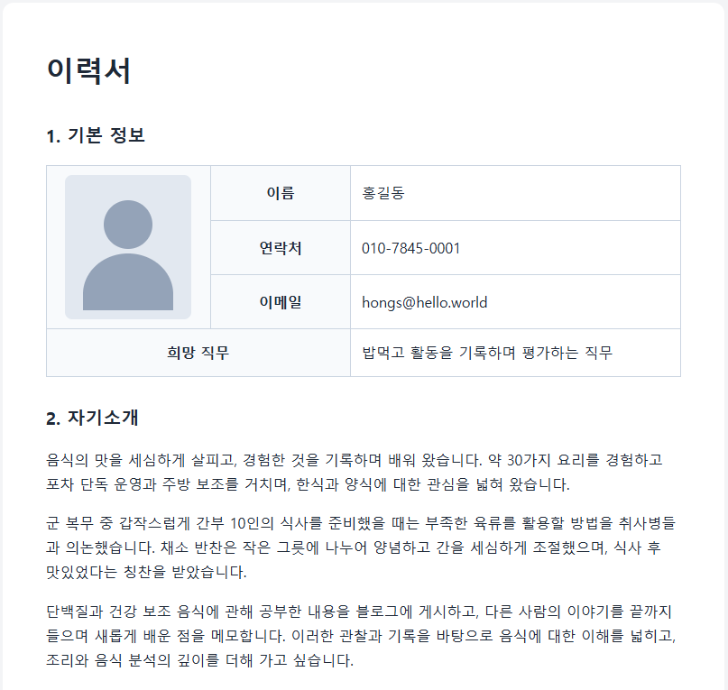
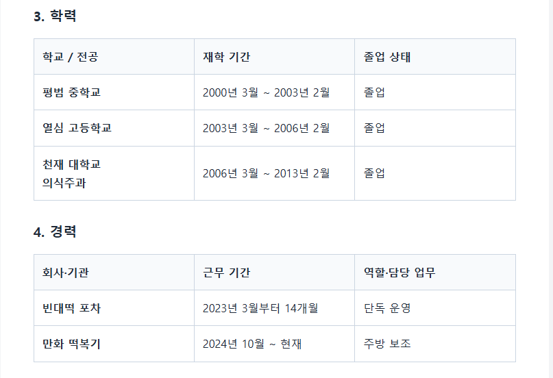
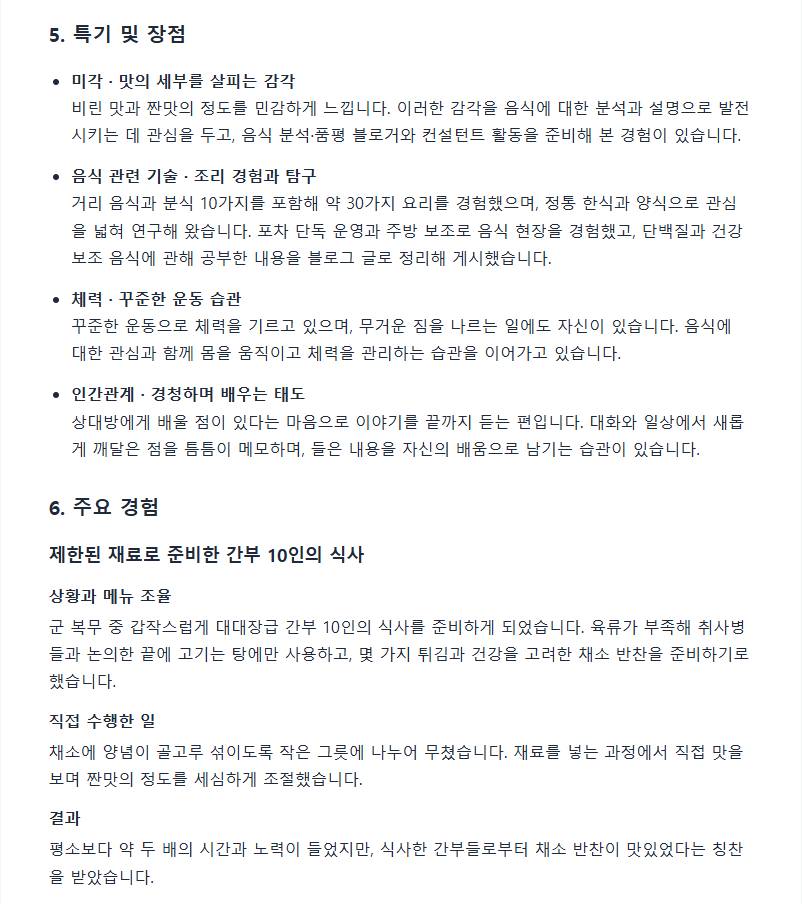
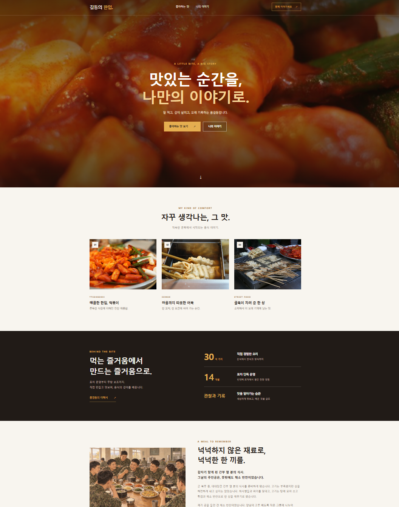

# Resume: 한 장씩 완성하는 나의 이력서

**내용을 제공할 때마다 이력서 화면과 코드가 조금씩 확장되는 과정을 경험합니다.** AI가 처음부터 전체 이력서를 만들지 않고, 여러분과 한 장씩 작성하고 확인합니다. 코드를 직접 작성하거나 문법을 외울 필요는 없습니다.

완성 결과물은 브라우저에서 여는 이력서 웹페이지입니다. 여기서 ‘장’은 이력서의 내용 구역을 뜻하며, 인쇄용 페이지 수를 뜻하지 않습니다. 이력서를 완성한 뒤에는 같은 자료를 활용해 사진과 이야기가 중심인 **개인 PR 페이지**로 발전시킬 수 있습니다.

## 실행 결과

실습으로 완성한 이력서의 예시입니다.





## 준비하기

VS Code에서 작업 폴더를 열고 파일을 읽고 수정할 수 있는 AI 도구와 대화할 수 있으면 시작할 수 있습니다. 준비가 필요하면 [설치 안내](../../setup/README.md)를 참고하세요. GitHub 계정, 저장소 복제, Node.js, 데이터베이스는 필요하지 않습니다. AI 도구의 이용 요금은 사용하는 서비스에 따릅니다.

내용은 대화창에 직접 입력하거나 **기존 문서의 이미지 또는 PDF만** 첨부할 수 있습니다. Word 등 다른 형식은 이미지나 PDF로 변환하거나 필요한 내용을 대화창에 입력하세요. 첨부 기능이 없다면 작업 폴더에 이미지·PDF를 넣고 파일명을 알려 주면 됩니다. 도구가 해당 파일을 읽지 못하면 직접 입력하는 방식으로 이어갑니다.

실습에는 이력서에 넣고 싶은 정보만 제공하세요. 기존 문서에 불필요한 개인정보가 있으면 가린 사본을 사용할 수 있습니다.

## 시작하기

[AGENTS.md](./AGENTS.md) 본문을 현재 작업 폴더의 `AGENTS.md`로 복사해 저장하세요. 기존 파일이 있다면 보관할 내용을 먼저 별도로 복사해 두세요. 이 저장소를 열어 둔 경우에는 복사 없이 해당 지침의 경로를 AI에게 알려 주어도 됩니다.

```text
AGENTS.md를 읽고 이력서 실습을 안내해 줘.
한 장씩 내용을 제공하고, 추가된 코드와 화면을 확인하며 진행하고 싶어.
```

저장소에서 바로 시작할 때는 첫 문장을 “solutions/resume/AGENTS.md를 읽고 이력서 실습을 안내해 줘”로 바꾸세요.

AI는 작업 폴더의 `codes/resume.html`에 제목과 최소한의 틀부터 만듭니다. 파일 탐색기에서 이 파일을 브라우저로 열고, VS Code에서도 같은 파일을 열어 두세요. 기존 파일이 있다면 AI가 내용을 확인하여 이어서 작업하거나 다른 이름을 안내합니다.

## 작성 순서

**작성은 1 → 3 → 4 → 5 → 6 → 2장 순서**, 완성된 화면은 **1 → 2 → 3 → 4 → 5 → 6장 순서**입니다. 자기소개는 학력부터 주요 경험까지 정리한 뒤 작성합니다.

| 작성 단계 | 제공할 내용 | 이번에 생기는 화면 |
| --- | --- | --- |
| 1. 기본 정보 | 이름 또는 별명, 희망 직무, 포함하고 싶은 연락처 등 | 기본 정보 구역 |
| 3. 학력 | 학교, 전공, 재학 기간, 졸업 상태 등 | 학력 구역 |
| 4. 경력 | 회사·기관, 기간, 역할, 담당 업무와 성과 등 | 경력 구역 |
| 5. 특기 및 장점 | 잘하는 일, 보유 기술, 강점을 보여 주는 근거 등 | 특기 및 장점 구역 |
| 6. 주요 경험 | 프로젝트·활동, 상황과 역할, 수행한 일, 결과·배운 점 등 | 주요 경험 구역 |
| 2. 자기소개 | AI가 3~6장에 근거한 방향과 초안을 추천하면 검토 | 기본 정보 다음에 자기소개 구역 |

AI는 현재 장에 필요한 내용만 묻습니다. 경력이 없거나 넣고 싶지 않은 항목은 “없음” 또는 “건너뛰기”라고 말해도 됩니다. 허구의 내용을 채울 필요는 없습니다.

기존 문서를 한 번에 올려도 전체 코드가 한꺼번에 생성되지는 않습니다. AI는 현재 장에 해당하는 내용부터 보여 주고 확인을 받은 뒤 반영합니다. 읽기 어려운 글자나 날짜는 여러분에게 확인합니다. 이미 문서에서 확인한 내용을 매번 다시 입력할 필요는 없습니다.

## 매 단계에서 코드와 화면 확인하기

AI는 코드가 추가되거나 수정될 때마다 **“이번에 추가·변경된 코드를 확인하실 수 있습니다.”**라고 강조해서 안내합니다. 화면뿐 아니라 코드가 어떻게 늘어나고 바뀌는지도 함께 살펴보세요.

1. 현재 장의 내용을 직접 입력하거나 이미지·PDF로 제공합니다.
2. AI가 이번 장만 추가하고, 실제 파일에서 새로 생긴 구역과 짧은 코드 발췌를 보여 줍니다.
3. VS Code에서 AI가 알려 준 주석이나 구역 이름을 찾아 새 코드가 추가된 것을 봅니다.
4. 브라우저를 새로고침하여 입력한 내용이 화면에 나타나는지 확인합니다.
5. AI가 **“추가·변경된 코드에서 궁금한 부분이 있으신가요?”**라고 물으면 궁금한 내용을 편하게 질문하세요. 고칠 내용도 요청할 수 있습니다. 확인이 끝나면 “질문 없어. 다음 장으로 가자”라고 말합니다.

예를 들어 기본 정보만 있던 파일에 학력 구역이 추가되면, AI는 새로 생긴 코드와 화면의 학력 구역을 연결해 설명합니다. 전체 코드의 모든 줄을 읽거나 이해할 필요는 없습니다. 파일 경로나 줄 번호는 실제 생성된 파일에 따라 달라집니다.

“이 부분은 어떤 역할이야?”, “이 코드와 화면의 학력 항목은 어떻게 연결돼?”처럼 질문해 보세요. AI는 해당 부분을 짧게 보여 주며 설명하고, 더 궁금한 점이 있는지도 확인합니다. 이 과정은 새 장을 추가할 때뿐 아니라 기존 내용이나 디자인을 수정한 뒤에도 이어집니다. 질문이 없으면 바로 다음 단계로 진행할 수 있습니다.

## 자기소개는 마지막에 함께 작성하기

3~6장이 정리되면 AI가 그 내용에서 드러나는 강점과 자기소개 방향을 추천하고 초안을 작성합니다. 사실과 다르거나 과장된 부분이 없는지, 자신의 말투와 맞는지 확인하세요. 자료가 부족하면 AI가 짧게 추가 질문하거나 확인된 내용만으로 초안을 제시합니다.

“이 방향으로 반영해 줘”라고 하면 AI가 **2. 자기소개**를 기본 정보 다음에 추가합니다. 이후에도 다른 장과 마찬가지로 코드와 화면의 변화를 확인합니다.

## 홈페이지처럼 다듬기

이력서를 완성했다면, 이번에는 방문자가 나를 기억할 수 있는 **원페이지 개인 PR 사이트**로 바꿔 봅니다. 이력서에서 정리한 사실을 바탕으로 핵심 소개, 음식 사진, 강점과 대표 경험을 선별합니다. 모든 학력과 경력을 다시 나열하기보다, 자세한 내용은 원본 이력서로 연결합니다.

음식점이나 음식 전문회사의 채용 담당자가 방문한다고 생각해 보세요. 첫 화면은 음식에 대한 관심을 보여 주고, 짧은 소개와 경험담은 어떤 태도로 일하는 사람인지 전달하면 좋습니다. 음식 사진을 쓰더라도 가격이나 주문 버튼을 넣어 음식 판매 사이트로 바꿀 필요는 없습니다.

### 1. 참고 화면과 원하는 분위기 전달하기

“홈페이지처럼 만들어 줘”에 **방문자, 참고 사이트, 남길 내용, 글의 분량, 이미지, 글꼴, 저장 위치**를 덧붙이면 원하는 결과에 가까워집니다. 특히 참조할 페이지도 제시하면 좋습니다. 다음은 이번 예시의 요청입니다.

```text
codes/resume.html을 바탕으로 개인 PR 랜딩 페이지를 만들어 줘.
목표 방문자는 음식점과 음식 전문회사의 채용 담당자야.
https://cuban-bite-buddy.lovable.app/ 의 큰 음식 사진, 갈색과 골드 색상,
밝은 배경의 카드 구성을 참고해 줘.
텍스트는 최소화하고 떡볶이, 어묵 등 길거리 음식 사진을 넣어 줘.
소개와 강점은 이력서에 있는 사실만 활용하고, 자세한 이력서로 가는 링크도 넣어 줘.
폰트는 맑은 고딕 계열로 지정하고 모바일에서도 읽기 좋게 해 줘.
원본 이력서는 유지하고 codes/mypage.html에 만들어 줘.
이미지와 스타일 파일도 codes/ 안에 함께 배치해 줘.
```

참고 사이트에 접근할 수 없다면 캡처 이미지나 원하는 특징을 전달해도 됩니다. 가져온 사진은 출처와 사용 조건을 확인하고, 페이지와 함께 저장해 이미지 주소가 바뀌어도 표시되게 합니다. 이미지 생성 기능을 사용할 수 있다면 분위기에 맞는 삽화를 요청할 수도 있습니다.

### 2. 이력서의 내용을 화면의 역할에 맞게 바꾸기

| 화면 구역 | 활용할 자료와 표현 |
| --- | --- |
| 첫 화면 | 큰 음식 사진과 “맛있는 순간을, 나만의 이야기로.” 같은 짧은 소개 |
| 좋아하는 맛 | 떡볶이·어묵·길거리 음식 사진과 한 줄 설명 |
| 나의 이야기 | 약 30가지 요리 경험, 14개월 포차 운영, 관찰과 기록 습관 |
| 대표 경험 | 6장 주요 경험을 삽화와 짧은 이야기로 재구성 |
| 연락 | 이력서에 제공한 이메일·전화와 연락 링크 |

숫자와 경력은 원본과 일치해야 합니다. 문체를 매끄럽게 바꾸더라도 새로운 자격, 성과나 타인의 발언을 만들어 넣지 않도록 확인하세요.

### 3. 대표 경험을 이야기로 보완하기

첫 결과에서 빠진 내용이나 아쉬운 배치는 구역을 지정해 추가 요청합니다. 이번에는 군 복무 중 간부 10인의 식사를 준비한 경험을 소개 섹션 다음에 넣었습니다.

```text
codes/resume.html의 <!-- 6. 주요 경험 시작 --> 항목을
codes/mypage.html에도 반영해 줘.
about 섹션 바로 다음에 배치하고,
왼쪽에는 군인들이 즐겁게 함께 식사하는 따뜻한 삽화를 넣어 줘.
오른쪽에는 나의 경험을 맛깔나는 문체의 짧은 이야기로 풀어 줘.
재료 부족, 취사병들과의 메뉴 조율, 작은 그릇에 나누어 양념한 과정,
간을 조절한 노력과 채소 반찬에 대한 칭찬은 그대로 살려 줘.
모바일에서는 삽화 아래에 이야기가 나오게 해 줘.
```

“넉넉하지 않은 재료로, 넉넉한 한 끼를.”이라는 제목 아래 **상황 → 직접 한 일 → 결과와 배운 점**이 이어집니다. 전체 페이지는 짧게 유지하면서, 대표 경험 한 곳에서만 이야기를 조금 더 풀어 강점의 근거를 보여 줍니다. AI로 만든 장면은 실제 당시 사진과 구분되도록 삽화임을 표시합니다.



### 4. 코드와 화면을 비교하며 마무리하기

VS Code에서 `about` 구역 다음의 `<!-- 6. 주요 경험 시작 -->` 주석을 찾고, 삽화와 본문을 담는 코드가 추가된 모습을 확인하세요. 브라우저에서는 페이지를 새로고침하고 창 너비를 줄여 좌우 배치가 위아래로 바뀌는지 살펴봅니다. 사진 표시, 메뉴 이동, 이력서 링크와 연락 링크도 확인합니다. AI가 코드만 점검했는지 실제 화면까지 확인했는지는 구분해서 안내받으세요.

현재 구현은 `codes/mypage.html`이며 이미지와 스타일도 같은 폴더 안에 있습니다. [대화 예시](./dialogues.md)의 고도화 과정은 최종 결과 경로를 `codes/mypage.html`로 통일해 재구성했습니다. 저장 위치를 바꾸면 이미지·스타일·이력서 링크의 상대 경로도 함께 맞춰야 합니다.

## 도움받기와 마무리

- 코드 설명이 어렵다면 “새로 추가한 부분이 화면의 어디인지 쉽게 설명해 줘”라고 요청하세요.
- 파일 내용이 잘못 읽혔다면 올바른 내용을 알려 주세요. AI가 확인한 뒤 해당 장을 수정합니다.
- 화면이 바뀌지 않았다면 AI가 안내한 파일을 열었는지 확인하고 새로고침하세요.
- AI는 필요할 때 더 명확하게 요청하는 표현도 짧게 제안합니다. 조언을 원하지 않으면 생략해 달라고 말하세요.

만족하면 “여기까지 할게”라고 말하세요. 중간에 멈춰도 AI가 완성한 장과 남은 장을 정리해 줍니다. 나중에 같은 파일에서 이어갈 수 있습니다. 완성한 이력서는 `codes/resume.html`, 이 저장소의 개인 PR 페이지는 `codes/mypage.html`을 열어 사용합니다. 실습만으로 인터넷에 게시되지는 않습니다.
