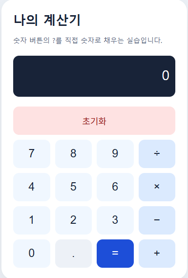

# 사칙 연산 계산기 만들기 — 대화 예시

코딩을 처음 접하는 학습자가 계산기를 요청하고, 거듭제곱 기능을 추가한 뒤 설명 문구를 수정한 과정입니다. 사용자 요청은 원문으로 기록하고, AI의 응답은 작업 결과와 안내 위주로 정리했습니다.

결과물은 연습 폴더 아래 `codes/calculator.html`에 저장합니다.

## 예시 결과물

## 1. 시작과 주제 선택

**사용자**

> 나는 완전 초보자다. AGENTS.md 파일을 읽고, 문서의 지침에 따라 나를 안내해 줘.

**AI**

> 문서의 지침을 읽었습니다. 
> 코드는 제가 만들고, 결과를 함께 확인할게요. 저도 실수할 수 있으니 설명이 어렵거나 결과가 다르면 편하게 “더 쉽게 설명해 줘” 또는 “말한 화면과 달라”라고 말씀해 주세요.
>
> 어떤 것을 만들어 볼까요?
>
> 1. 자기 소개 웹사이트 — 소개 글과 사진을 담은 페이지
> 2. 사칙 연산 계산기 — 숫자 버튼으로 계산하는 프로그램
>
> 원하는 번호나 이름을 말씀해 주세요.

**사용자**

> 2번

## 2. 계산기 만들기

**AI**

> 계산기를 만들었습니다. 사칙 연산, 소수점 계산, 전체 지우기를 사용할 수 있어요. 계산과 오류 처리도 확인했습니다.
>
> 파일 위치: `~~\codes\calculator.html`
>
> 먼저 계산기를 열어 볼게요. 파일 탐색기에서 `~~\codes`를 주소창에 붙여 넣고 Enter를 누르세요.
>
> 그 안의 `calculator.html`을 두 번 클릭하면 브라우저에서 열립니다. 계산기 화면이 보이면 알려 주세요.

## 3. 거듭제곱 추가

**사용자**

> 좋아. 거듭제곱 연산 ^ 도 추가해 줘.

**AI**

> 계산기에 거듭제곱 `^` 버튼을 추가했습니다. 키보드의 `^`도 사용할 수 있어요. `2 ^ 3 = 8` 계산도 확인했습니다.
>
> 열어 둔 계산기에서 F5로 새로고침한 뒤, 2 → ^ → 3 → =을 눌러 보세요. 8이 나오나요?

## 4. 예시 설명 삭제

**사용자**

> 거듭제곱 예: 2 ^ 3 = 8 (2 × 2 × 2)   설명 구문을 뺀다.

**AI**

> 계산기에서 거듭제곱 예시 설명을 삭제했습니다. F5로 새로고침하면 확인할 수 있어요.
