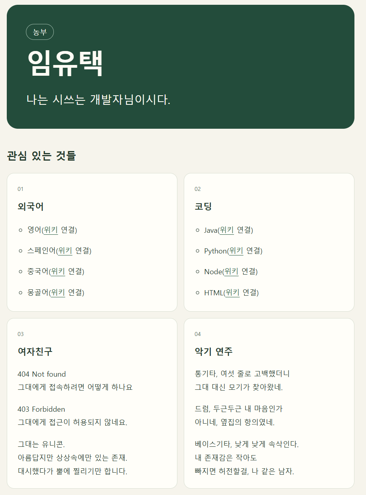

# 자기 소개 웹사이트 만들기 — 대화 예시

코딩을 처음 접하는 학습자가 계산기를 요청하고, 거듭제곱 기능을 추가한 뒤 설명 문구를 수정한 과정입니다. 사용자 요청은 원문으로 기록하고, AI의 응답은 작업 결과와 안내 위주로 정리했습니다.

결과물은 연습 폴더 아래 `codes/myweb.html`에 저장합니다. 

## 예시 결과물

## 1. 시작과 주제 선택

**사용자**

> 나는 완전 초보자다. AGENTS.md 파일을 읽고, 문서의 지침에 따라 나를 안내해 줘.

**AI**

> 문서의 지침을 읽었습니다. 
> 코드는 제가 만들고, 결과를 함께 확인할게요. 저도 실수할 수 있으니 설명이 어렵거나 결과가 다르면 편하게 “더 쉽게 설명해 줘” 또는 “말한 화면과 달라”라고 말씀해 주세요.
>
> 어떤 것을 만들어 볼까요?
>
> 1. 자기 소개 웹사이트 — 소개 글과 사진을 담은 페이지
> 2. 사칙 연산 계산기 — 숫자 버튼으로 계산하는 프로그램
>
> 원하는 번호나 이름을 말씀해 주세요.

**사용자**

> 1번

**AI**
> 웹사이트에 넣고 싶은 이름이나 별명, 간단한 소개, 관심사를 알려 주세요. 준비한 내용이 없으면 “예시로 만들어 주세요”라고 하셔도 됩니다.
>
> 사진도 넣고 싶다면 현재 폴더에 사진을 복사한 뒤 파일 이름을 알려 주세요. 사진 없이 시작해도 괜찮아요.

## 2. 첫 페이지 만들기

**사용자**

> 김행복, 농부, 나는 시쓰는 개발자님이시다. 외국어, 코딩, (현재 없지만) 여자친구, 악기 연주에 관심이 많다.

**AI**

> 이름과 소개, 네 가지 관심사를 담은 초록색 자기 소개 페이지를 만들었어요.
>
> 파일: `~~\codes\myweb.html`
>
> 윈도우 파일 탐색기에서 연습 폴더 안의 `codes` 폴더를 열고, `myweb.html`을 두 번 눌러 주세요. 인터넷 브라우저에서 페이지가 열립니다.
>
> 아직 브라우저 화면은 직접 확인하지 못했어요. 열어 보시고 소개 내용이 원하는 대로 보이는지 알려 주세요.

## 3. 외국어 목록과 위키 링크 추가

**사용자**

> 외국어 에 영어, 스페인어, 중국어, 몽골어 등을 하위로 넣어 주고, 해당 국가별 나무위키 링크를 붙여 줘.

**AI**

> 외국어 하위 목록과 국가별 나무위키 링크를 추가했어요.
>
> - 영어 → 영국
> - 스페인어 → 스페인
> - 중국어 → 중국
> - 몽골어 → 몽골
>
> 브라우저에서 F5로 새로고침한 뒤 링크 하나를 눌러 확인해 주세요. 제 도구에서는 나무위키 접속이 되지 않아 실제 페이지가 열리는지는 확인하지 못했어요.

## 4. 코딩 목록 추가와 링크 표시 변경

**사용자**

> 코딩에는 Java, Python, Node, html 등을 넣고 역시 위키를 연결해 주세요.
> 그리고 '영어 — [영국 나무위키](https://namu.wiki/w/영국)' 형식 대신 영어([위키](https://namu.wiki/w/영국) 연결) 이 더 좋을 것 같다.

**AI**

> 코딩에 Java, Python, Node, HTML과 나무위키 링크를 추가했어요.
>
> 외국어와 코딩 모두 영어(위키 연결)처럼 표시하고, ‘위키’ 글자에 링크를 붙였어요. Node는 Node.js 문서로 연결했어요.
>
> 브라우저에서 F5를 눌러 바뀐 목록을 확인해 주세요. 나무위키는 제 도구에서 접속되지 않아 실제 연결 화면은 확인하지 못했어요.

## 5. 여자친구 항목에 시 넣기

**사용자**

> 여자 친구 항목에는 '익살스러운 시' 로 넣고 싶다.
> 그대는 유니콘. 아름답지만 상상속에만 있는 존재. 그동안 대시했다가 뿔에 찔리기만 했다. 유니콘을 만들기 위해 말을 구해 보기도 했다. 그러나 결국 그대는 상상속의 존재. 404 Not found 또는 403 Forbidden

**AI**

> 여자친구 항목에 ‘익살스러운 시’를 넣었어요. 주신 문장을 유지하면서 시처럼 줄과 문단을 나누었습니다.
>
> 브라우저에서 F5를 눌러 시의 줄 나눔이 마음에 드는지 확인해 주세요.

## 6. 시의 최종 문구 정리

**사용자**

> 404 Not found  
> 그대에게 접속하려면 어떻게 하나요
>
> 403 Forbidden  
> 그대에게 접근이 허용되지 않네요.
>
> 그대는 유니콘.  
> 아름답지만 상상속에만 있는 존재.  
> 대시했다가 뿔에 찔리기만 합니다.
>
> 위와 같이 최종 정리하다. '익살스러운 시' 라는 표현은 제거해 줘.

**AI**

> 주신 최종 문구와 줄바꿈을 반영하고, ‘익살스러운 시’ 제목을 제거했어요.
>
> 브라우저에서 F5를 눌러 수정된 내용을 확인해 주세요.

## 7. 악기 연주에 시 추가와 높이 맞추기

**사용자**

> 악기 연주에 통기타, 드럼, 베이스기타 순으로 시를 넣었으면 한다. 약간 유치해도 좋으며 여자 친구 섹션의 높이와 맞추고 싶다.

**AI**

> 통기타 → 드럼 → 베이스기타 순서로 장난스러운 시를 넣었어요.
>
> 통기타, 여섯 줄로 고백했더니  
> 그대 대신 모기가 찾아왔네.
>
> 드럼, 두근두근 내 마음인가  
> 아니네, 옆집의 항의였네.
>
> 베이스기타, 낮게 낮게 속삭인다.  
> 내 존재감은 작아도  
> 빠지면 허전할걸, 나 같은 남자.
>
> 두 항목이 나란히 표시될 때 같은 높이가 되도록 설정했어요. F5로 새로고침해서 확인해 주세요.
